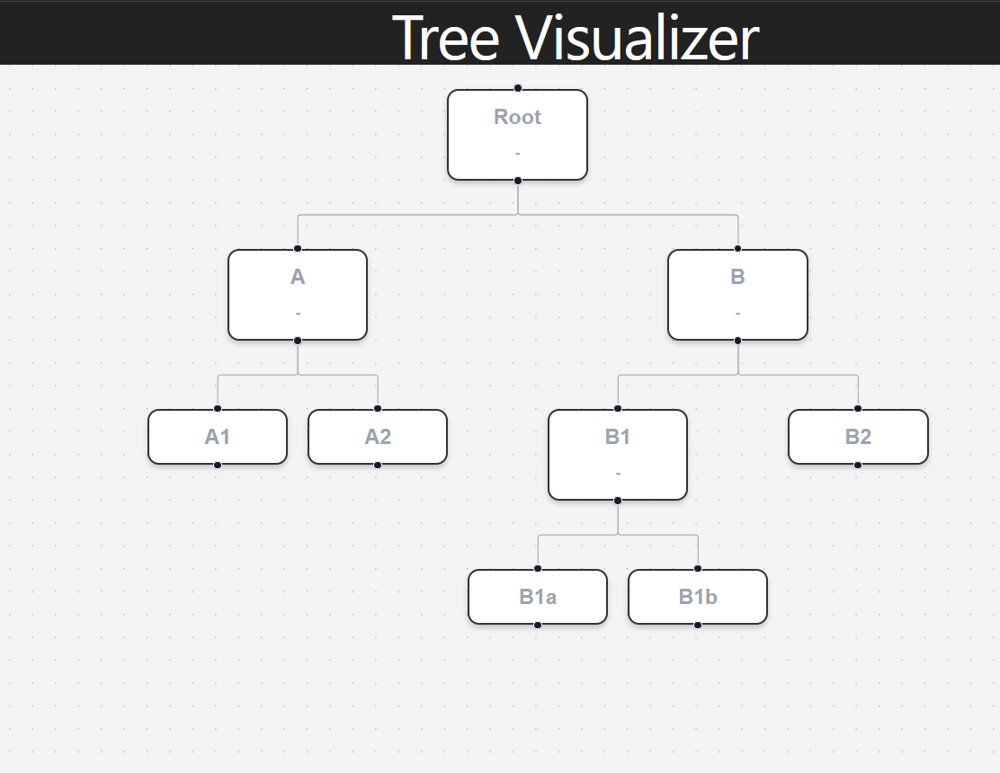

# Tree Visualizer

A React Flow based Tree Visualizer project.

## Project Screenshot

 

## Features
- Interactive tree visualization
- Expand and collapse nodes
- Smooth edges between nodes
- Zoom and minimap support

## Technologies Used
- React
- React Flow
- Vite

## Run Locally

```bash
npm install
npm run dev

## Live Demo
https://tree-visualizer-kappa.vercel.app
